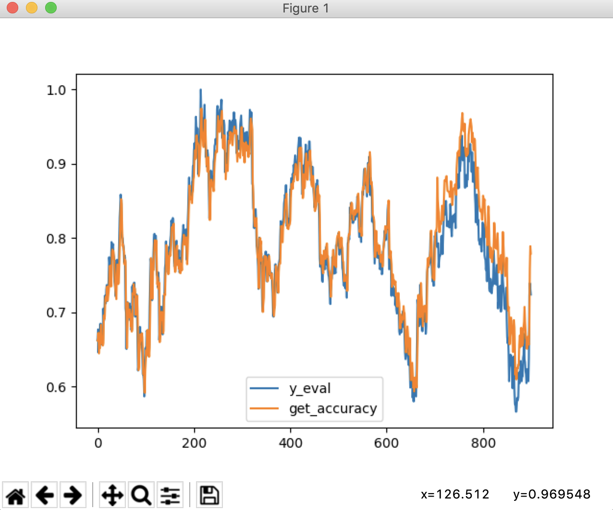
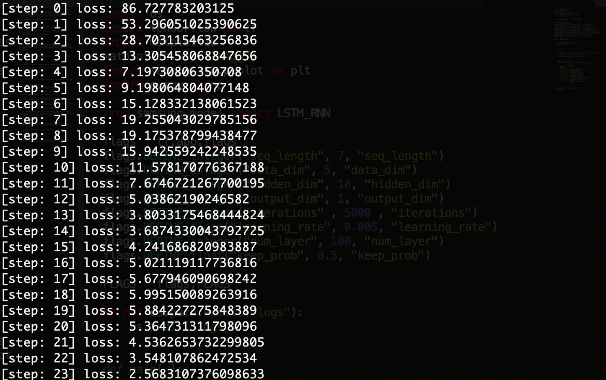
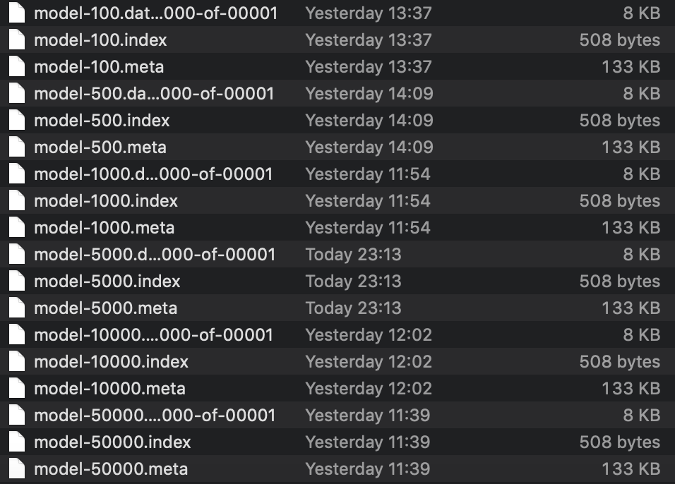
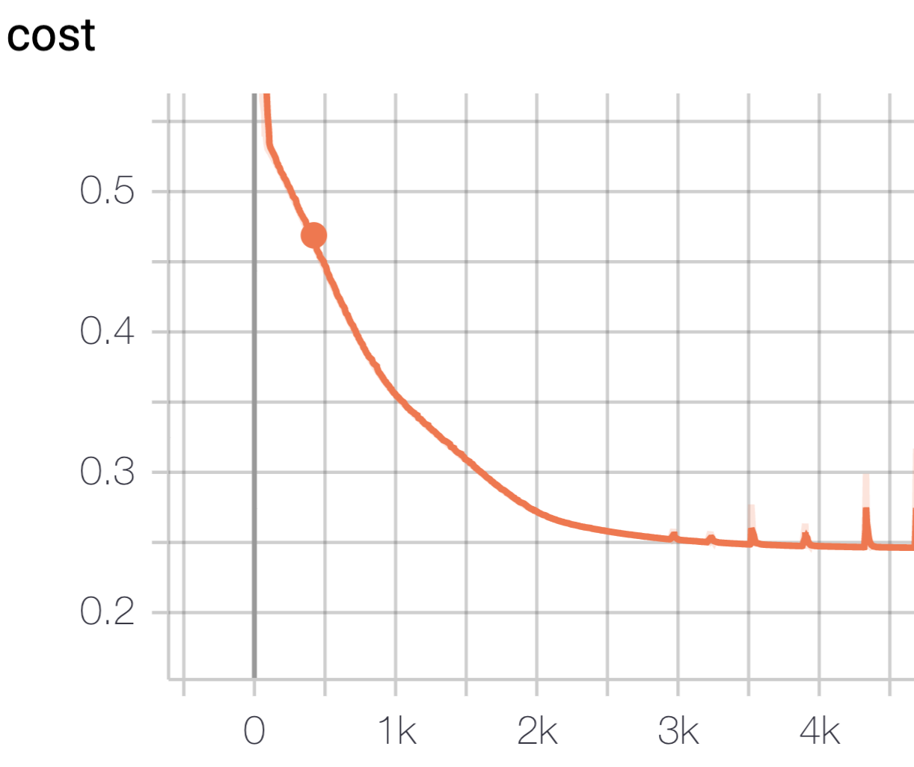
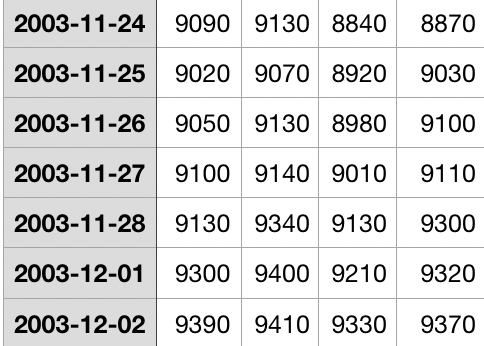
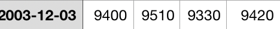

# 4886 data of Stock in Samsung file

These data have the time When the stock market opened, closed, was high and low. Periodically I have embeded 7 data and gotten 1 output. Also I used 70% of data for the trainning and 30% of data for the evaluation. And I make a test and get a result.   

# Explaination (Classification and Object Detection)

# 1. Data

I respectively download a Samsung file on the website, Yahoo Stock, and take 20years-data til 2019, march from 2000, march.

- Used Sequence_length, data dimention, hidden_dim, and etc on Prediction.py
- run 50,000 epochs with these data

# 2. Model 

There are a couple of options, LSTM and MultiRNNCell. I use LSTM for the trianning on GPU: Used AWS to use GPU that has p2.x2large to operate model. I have used 50,000 epochs on GPU based on Object Detection.

# 3. Tensorboard(the function of early stopping is in the file, model.py) 

# 4. Result - 9470 on the real data -> Prediction has 9407.231

# Installation

- You can install some packages, tensorflow, pandas, and numpy

`pip install -r requirement.txt`
`pip3 install -r requirement.txt`

# How to Use Classification and Object Detection

Simply, use prediction.py

`python prediction.py`

